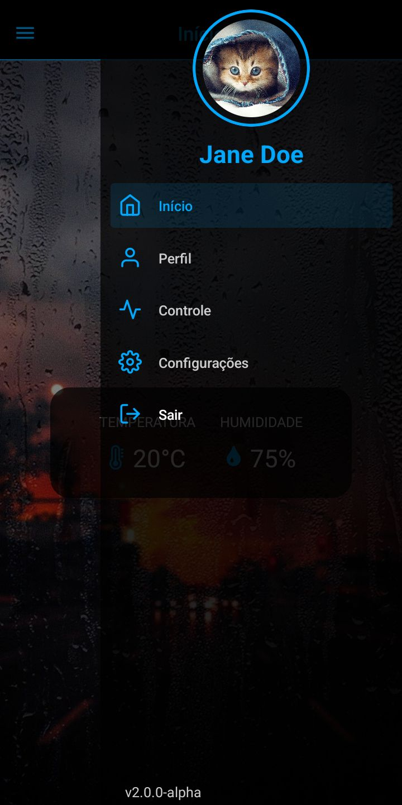
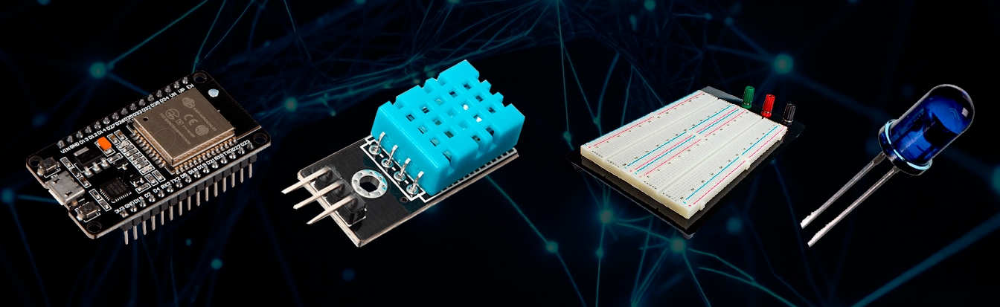

    
    <h1 align="center" color="">ThermoSense</h1>

    
    

 

**Developers**: [Filipe Ramos](https://github.com/filipe-2), [Yara França](https://github.com/Yarafranca), Lorenzzo, Lara Bastos, José Dário

Welcome! This is the repository for the ThermoSense project, here you will find all the code and assets used in our project, as well as the APK builds of our app to use on your Android. The APK files are available within the [releases](https://github.com/filipe-2/thermosense/releases/) page.

## Preview

    

## Description

**Hardwares used**: [ESP32 WiFi module](https://www.espressif.com/en/products/socs/esp32), [DHT11 Sensor](https://components101.com/sensors/dht11-temperature-sensor), [Breadboard](https://en.m.wikipedia.org/wiki/Breadboard), and [TSAL6200 IR Emitter](https://in.element14.com/vishay/tsal6200/infrared-emitter-940nm-t-1-3-4/dp/3152856).

**Softwares used**: JavaScript, C, C++, Firebase, Git, Arduino IDE, React Native, and Expo.

 

## How to access the app?

Go to the [releases](https://github.com/filipe-2/thermosense/releases/) page and download the APK from the latest release on your Android device.
